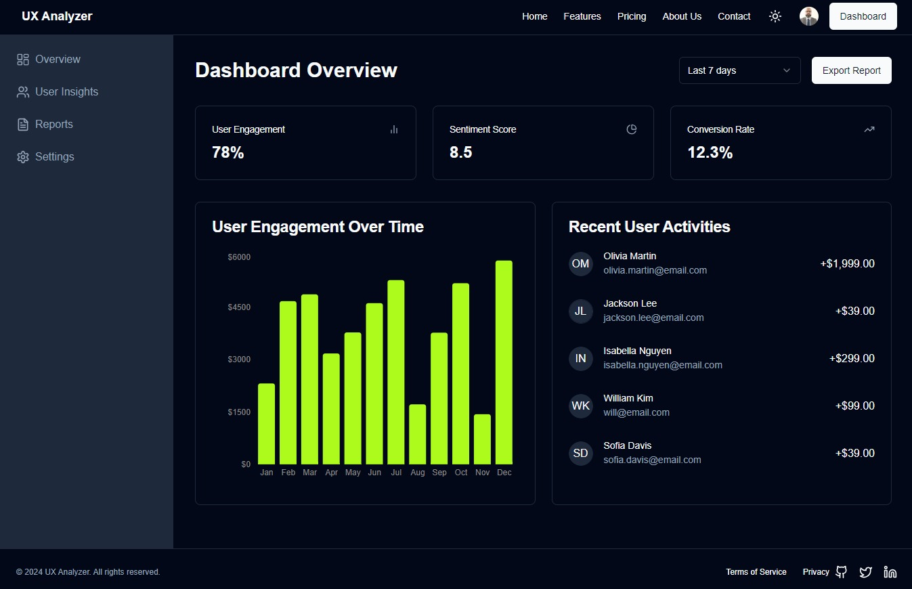

# Project Title: User Pulse Dashboard Application

## Description

User Pulse is a modern dashboard application built with Next.js, TypeScript, and Clerk for authentication. The application provides an intuitive interface for users to monitor key metrics, visualize data through interactive charts, and manage user insights effectively.

## Demo

You can view a live demo of the project at [userpulse-plew.vercel.app](https://userpulse-plew.vercel.app).

## Features

- **User Authentication**: Secure sign-in and sign-out functionality using Clerk.
- **Responsive Design**: Optimized for both desktop and mobile views.
- **Dynamic Data Visualization**: Interactive charts displaying user engagement, sentiment scores, and conversion rates.
- **Sidebar Navigation**: Easy navigation through various sections like Overview, User Insights, Reports, and Settings.
- **Date Range Selector**: Ability to filter metrics by different date ranges (Last 7 days, 30 days, 90 days).
- **Export Report Functionality**: Option to export metrics for further analysis.

## Technologies Used

- **Frontend**: Next.js, React, TypeScript
- **UI Components**: Tailwind CSS for styling, Lucide icons for UI elements.
- **State Management**: React's useState hook for managing local state.
- **Authentication**: Clerk for user authentication and management.

## Getting Started

### Prerequisites

- Node.js
- npm or yarn

### Installation

1. Clone the repository:
   ```bash
   git clone <repository-url>
   ```

2. Navigate to the project directory:
   ```bash
   cd <project-directory>
   ```

3. Install dependencies:
   ```bash
   npm install
   ```

4. Create a `.env.local` file and add your Clerk publishable key and secret key:
   ```plaintext
   NEXTAUTH_URL=http://localhost:3000
   NEXT_PUBLIC_CLERK_PUBLISHABLE_KEY=<your-publishable-key>
   CLERK_SECRET_KEY=<your-secret-key>
   ```

5. Run the application:
   ```bash
   npm run dev
   ```

## Deployment

Deploy your application to Vercel or your preferred hosting platform for production use.

## License

This project is licensed under the MIT License - see the [LICENSE](LICENSE) file for details.

---

Feel free to adjust any part of this summary to better fit your project's specifics! If you need further modifications or additional information, let me know!
